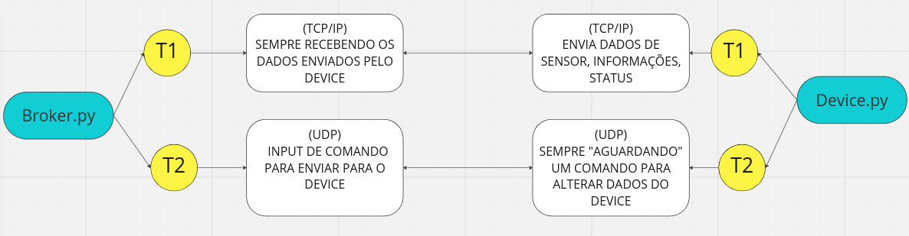
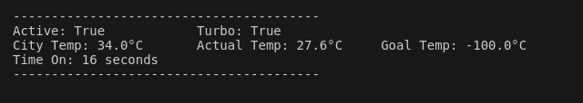
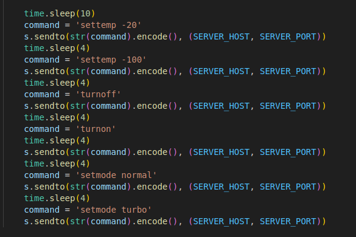

Este é o código fonte desenvolvido para o Problema 1 da discipila TEC502 - Concorrência e Conectividade.

Basicamente, o software consiste em um arquivo Device.py, que simula um dispositivo, no meu caso um Ar condicionado.
E o Broker.py, que representa o servidor que recebe dados gerados pelo dispositivo e envia comandos.
Os comandos que podem ser enviados pelo broker são: Desligar, Ligar, Setar temperatura desejada e setar modo de funcionamento (normal ou turbo).

Cada modo de funcionamento altera a forma com que a temperatura é manipulada. Se está desligando ela aumenta, se está no normal ela diminui, se está no turbo ela diminui mais rápido.
Dentre os dados de temperatura, existem o "City Temp" que é a temperatura da cidade, a qual vai ser alcancaçada se o Ar Condiconado ficar desligado.
"Goal temp" que é a temperatura objetivo, que vai ser alcançada em mais ou menos tempo de AC ligado, dependendno do modo de funcionamento.
E a "Actual temp" que á temperatura atual, atualizada por segundo a partir dos parâmetros definidos.
Existe também a contágem de quanto tempo em segundos em que o Ar Condicionado está ligado, atualizado a cada segundo.

A respeito da comunicação entre Broker e Device, os dados são enviados de por meio de comunicação confiável (TCP/IP), já os comandos são por meio não confiável (UDP).

A concorrência entre a comunicação é feita a partir do princípio de Threads.
Do lado do Broker existem duas Threads, uma responsável por estar sempre recebendo os dados do device e outra que é responsável por fazer o envio dos comandos.
Do lado do Device existem três Threads, uma responsável por estar sempre enviando os dados gerados, outra responsável por receber os comandos e realizar as funções definidas para cada um, e uma terceira que é responsável peal dinâmica da mudaça de temperatura.
Abaixo existe um diagrama que representa as relações entre as Threads.

A respeito do funcionamento do software e do código fonte:
Broker e Device se comunicam perfeitamente, os comandos e dados são enviados e recebidos de forma totalmente funcional.
Os testes que comprovam o funcionamento são feitos a partir de uma série de comandos pré configurados que testam o envio e a execução dos comandos.
Abaixo existem imagens do trecho de código dos testes e uma imagem da tela de dados Broker.

